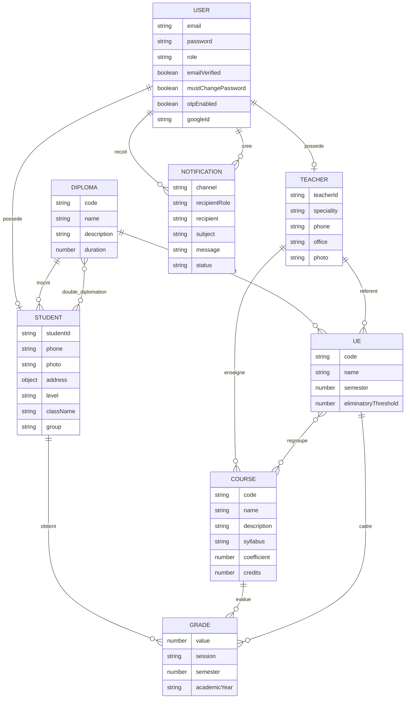

# Gestion academique - React / Node.js

Application web de gestion academique pour suivre les etudiants, les matieres, les UE, les diplomes, les professeurs, les notes et les statistiques. Le projet se compose d'un frontend React et d'une API Node.js connectee a MongoDB.

## Contributors

- Tabrani Mehdi

## Architecture

```text
gestion-academique/
  frontend/                 Interface React + Material UI
  backend/                  API REST Express + MongoDB
    controllers/            Logique metier des entites
    models/                 Schemas Mongoose
    routes/                 Routes API protegees par role
    middleware/             Authentification, roles, upload, erreurs
    seed/seed.js            Jeu de donnees complet pour MongoDB
    tests/smoke.ps1         Test rapide de l'API
  postman/                  Collection Postman de test API
  docker-compose.yml        Lancement complet MongoDB + API + frontend
```

Le frontend consomme l'API via `VITE_API_URL`. Si l'API est indisponible, certaines donnees restent visibles en mode local pour faciliter les demonstrations, mais les donnees persistantes viennent de MongoDB.

## Choix techniques

- React 18 avec Vite pour une interface rapide a lancer.
- Material UI pour les composants, le theme clair/sombre et le responsive.
- Recharts pour les dashboards et statistiques.
- Node.js, Express et Mongoose pour l'API REST.
- JWT pour proteger les routes apres connexion.
- Passport Google OAuth 2 pour le SSO.
- OTP compatible Google Authenticator / Microsoft Authenticator.
- Nodemailer pour les emails SMTP.
- Twilio optionnel pour les SMS.
- Docker pour lancer MongoDB, backend et frontend ensemble.

## Installation locale

### Backend

```powershell
cd backend
npm install
```

Creer un fichier `.env` dans `backend/`:

```env
PORT=5000
MONGODB_URI=mongodb://127.0.0.1:27017/academic_management
JWT_SECRET=change_this_secret
JWT_EXPIRE=7d
FRONTEND_URL=http://localhost:5173

GOOGLE_CLIENT_ID=your_google_client_id
GOOGLE_CLIENT_SECRET=your_google_client_secret

SMTP_HOST=smtp.gmail.com
SMTP_PORT=587
SMTP_SECURE=false
SMTP_USER=your_email@gmail.com
SMTP_PASS=your_app_password
SMTP_FROM=your_email@gmail.com

TWILIO_ACCOUNT_SID=
TWILIO_AUTH_TOKEN=
TWILIO_PHONE_NUMBER=
```

Importer les donnees de demonstration:

```powershell
npm run seed
```

Lancer l'API:

```powershell
npm run dev
```

API disponible sur `http://localhost:5000/api`.

### Frontend

```powershell
cd frontend
npm install
npm run dev
```

Interface disponible sur `http://localhost:5173` ou l'URL indiquee par Vite.

## Lancement avec Docker

Copier le fichier d'exemple Docker:

```powershell
Copy-Item .env.docker.example .env
```

Puis completer `.env` avec les valeurs disponibles. Pour tester les SMS reels, renseigner au minimum:

```env
TWILIO_ACCOUNT_SID=...
TWILIO_AUTH_TOKEN=...
TWILIO_PHONE_NUMBER=+12402215903
```

Le frontend Docker utilise `/api`; Nginx redirige ensuite les requetes vers le backend.

```powershell
docker compose up --build
```

- Frontend: `http://localhost`
- Backend: `http://localhost:5000/api`
- MongoDB: `localhost:27017`

Importer les donnees de demonstration dans les conteneurs:

```powershell
docker compose exec backend npm run seed
```

## Comptes de test

Apres `npm run seed`, tous les comptes utilisent le mot de passe `password123`.

| Role | Email |
| --- | --- |
| ADMIN | `admin@academic.com` |
| SCOLARITE | `scolarite1@academic.com` |
| TEACHER | `teacher1@academic.com` |
| TEACHER | `teacher2@academic.com` |
| STUDENT | `student1@academic.com` |
| STUDENT | `student2@academic.com` |
| STUDENT | `student3@academic.com` |

## Fonctionnalites implementees

- CRUD etudiants, matieres, notes, UE, diplomes et professeurs.
- Champs enrichis: photo, adresse, niveau, classe, groupe, description, syllabus, prerequis.
- Telephone au format international pour l'envoi SMS: `+212612345678`, `+33123456789` ou `00212612345678`.
- Niveau propose: `1AP`, `2AP`, `3eme Annee`, `4eme Annee`, `5eme Annee`.
- Filiere proposee: `GC`, `INFO (IIR)`, `Finance`, `Reseaux`, `Automatisme`.
- Association etudiant-cours depuis le formulaire etudiant.
- Double diplomation via le champ `Double Diplomation`.
- Notes regroupees par UE dans l'affichage et le bulletin.
- Validation des UE: moyenne >= 10 et aucune note sous le seuil eliminatoire.
- Validation du diplome basee sur les UE validees.
- Dashboards differents selon ADMIN, SCOLARITE, STUDENT et TEACHER.
- Export CSV et generation de bulletin imprimable en PDF.
- Theme clair/sombre et interface responsive.
- Google SSO, OTP, JWT et controle d'acces par role.
- Notifications plateforme ciblees ou generales, avec historique.
- Emails automatiques a la creation d'un compte etudiant/professeur.

## Authentification et securite

### Connexion classique

La connexion utilise `email + mot de passe`. Si l'OTP est active sur le compte, le champ `Code OTP si active` devient obligatoire au moment du login.

### Google SSO

Configurer dans Google Cloud Console:

En mode Docker (`http://localhost`):

- Origine JavaScript: `http://localhost`
- URI de redirection: `http://localhost/api/auth/google/callback`

En mode developpement React/Node (`frontend` sur `5173`, backend sur `5000`):

- Origine JavaScript: `http://localhost:5173`
- URI de redirection: `http://localhost:5000/api/auth/google/callback`

Puis renseigner dans `backend/.env`:

```env
GOOGLE_CLIENT_ID=...
GOOGLE_CLIENT_SECRET=...
```

Quand un compte Google utilise le meme email qu'un etudiant/professeur deja cree, l'API rattache le compte Google a cet utilisateur. L'etudiant voit donc ses propres notes si son email Google correspond a l'email du dossier etudiant.

### OTP

Activation depuis le menu `Securite`:

1. Cliquer sur `Configurer OTP`.
2. Scanner le QR code avec Google Authenticator ou Microsoft Authenticator.
3. Saisir le code a 6 chiffres.
4. A la prochaine connexion, remplir aussi `Code OTP si active`.

### Creation et validation des comptes

Quand ADMIN ou SCOLARITE cree un etudiant ou un professeur:

- l'API cree un compte utilisateur;
- un mot de passe temporaire est genere si aucun mot de passe n'est donne;
- un email est envoye avec l'email de connexion, le mot de passe temporaire et le lien de validation;
- le lien de validation permet de choisir un nouveau mot de passe;
- si un compte a encore `mustChangePassword=true`, l'interface affiche un ecran obligatoire de changement de mot de passe avant le tableau de bord.

## Notifications

Les notifications sont stockees en base et filtrees par destinataire.

- ADMIN et SCOLARITE voient l'ensemble des notifications.
- STUDENT et TEACHER voient leurs notifications ciblees et les annonces generales.
- Le badge rouge de la cloche disparait quand l'utilisateur ouvre la barre de notifications.
- Les notifications email utilisent SMTP.
- Les SMS utilisent Twilio si les variables Twilio sont configurees.
- Si un etudiant/professeur n'a pas de numero de telephone, le SMS n'est pas envoye mais la notification reste disponible sur la plateforme.

Cas email deja actives:

- creation d'un compte etudiant;
- creation d'un compte professeur;
- notification manuelle email depuis l'interface;
- note eliminatoire saisie pour un etudiant.

Pour tester l'email:

1. Configurer les variables `SMTP_*` dans `backend/.env`.
2. Relancer le backend.
3. Se connecter avec ADMIN ou SCOLARITE.
4. Creer un etudiant/professeur avec une adresse email valide.
5. Verifier la boite mail du destinataire.

Pour tester une notification ciblee:

1. Se connecter avec ADMIN ou SCOLARITE.
2. Aller dans `Notifications`.
3. Choisir `STUDENT` ou `TEACHER`.
4. Commencer a taper le nom du destinataire et selectionner la personne proposee.
5. Envoyer la notification.
6. Se connecter avec ce compte: la notification apparait.
7. Se connecter avec un autre compte: la notification ciblee ne doit pas apparaitre.

Pour tester un SMS:

1. Renseigner `TWILIO_ACCOUNT_SID`, `TWILIO_AUTH_TOKEN` et `TWILIO_PHONE_NUMBER`.
2. Ajouter un numero au profil de l'etudiant/professeur cible au format international, par exemple `+212612345678`.
3. Creer une notification avec le canal `SMS`.
4. Verifier le statut dans l'historique des notifications.
5. Retirer le numero du profil et refaire le test: la notification doit rester visible sur la plateforme avec le detail `SMS non envoye`.

Important: Twilio propose un compte d'essai avec un solde de test, mais ce n'est pas un service SMS gratuit et illimite. En mode trial, il faut verifier le numero destinataire dans Twilio avant de pouvoir lui envoyer un SMS. Avec un compte payant, les SMS sont factures selon le pays et l'operateur.

## Droits par role

| Role | Acces principal |
| --- | --- |
| ADMIN | Lecture/ecriture sur toutes les entites, comptes, diplomes et statistiques |
| SCOLARITE | Etudiants, matieres, notes, profils et associations etudiant-cours |
| STUDENT | Consultation du dossier, notes, statistiques personnelles, profil |
| TEACHER | UE et matieres affectees, etudiants concernes, saisie/consultation des notes de ses matieres |

## Base de donnees

Le jeu de donnees se trouve dans `backend/seed/seed.js`. Il cree:

- utilisateurs par role;
- etudiants;
- professeurs;
- matieres;
- UE;
- diplomes;
- notes;
- relations entre UE, matieres, diplomes et professeurs.

Commande:

```powershell
cd backend
npm run seed
```

## Schema ER



## Collection Postman

La collection est disponible dans:

```text
postman/Academic_Management_API.postman_collection.json
```

Utilisation conseillee:

1. Importer la collection dans Postman.
2. Definir `baseUrl` sur `http://localhost:5000/api`.
3. Lancer `POST /auth/login`.
4. Copier le JWT retourne.
5. Utiliser `Authorization: Bearer <token>` pour tester les routes protegees.

## Tests backend

Test rapide:

```powershell
cd backend
npm run test:smoke
```

Le smoke test verifie notamment:

- disponibilite de l'API;
- connexion des comptes de test;
- acces selon les roles;
- routes principales du backend.

## Conteneurisation

Le projet est lancable avec Docker grace a trois services:

- `mongodb`: base MongoDB avec volume persistant;
- `backend`: API Node.js construite depuis `backend/Dockerfile`;
- `frontend`: build React servi par Nginx depuis `frontend/Dockerfile`.

Le fichier `frontend/nginx.conf` redirige automatiquement les appels `/api` vers le service `backend`. Le navigateur appelle donc le frontend, et Nginx se charge de passer les requetes API au conteneur backend.

Commandes utiles:

```powershell
docker compose config
docker compose up --build
docker compose down
```

Apres lancement:

- application: `http://localhost`;
- API: `http://localhost/api` via Nginx ou `http://localhost:5000/api` directement;
- MongoDB: `localhost:27017`.

Pour importer le seed dans Docker:

```powershell
docker compose exec backend npm run seed
```

## Deploiement cloud

La procedure la plus simple consiste a utiliser un VPS ou une instance cloud avec Docker installe.

Etapes:

1. Creer une machine cloud chez Hostinger VPS, AWS EC2, Azure VM ou autre fournisseur.
2. Installer Docker et Docker Compose sur la machine.
3. Cloner le depot prive sur la machine.
4. Creer les fichiers `.env` necessaires, sans commiter les secrets.
5. Adapter `FRONTEND_URL` avec l'URL publique ou le nom de domaine.
6. Lancer `docker compose up --build -d`.
7. Ouvrir le port HTTP `80` et, si besoin, le port HTTPS `443`.
8. Configurer le domaine ou sous-domaine vers l'adresse IP du serveur.
9. Ajouter un certificat SSL avec Nginx Proxy Manager, Caddy ou Certbot.
10. Tester l'application, Google SSO, OTP, emails et notifications.

Pour Google SSO en production, ajouter dans Google Cloud Console:

- Origine JavaScript: `https://votre-domaine.com`;
- URI de redirection: `https://votre-domaine.com/api/auth/google/callback`.

Si le deploiement se fait sur Render, Railway ou Fly.io, le principe reste le meme: declarer les variables d'environnement, connecter le depot Git, puis lancer le build Docker.

## Notes de rendu

- Le depot doit rester prive jusqu'au rendu si c'est demande par l'enseignant.
- Les variables sensibles ne doivent pas etre commitees.
- Les fichiers `node_modules`, `.env` et les fichiers generes localement restent ignores.
